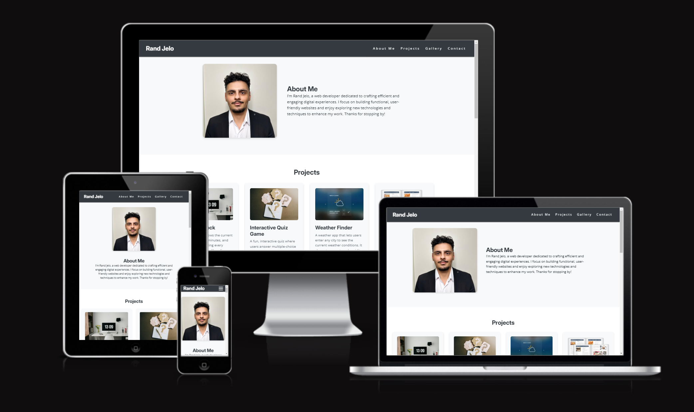
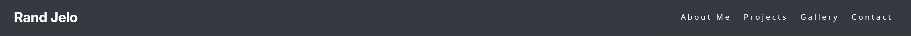
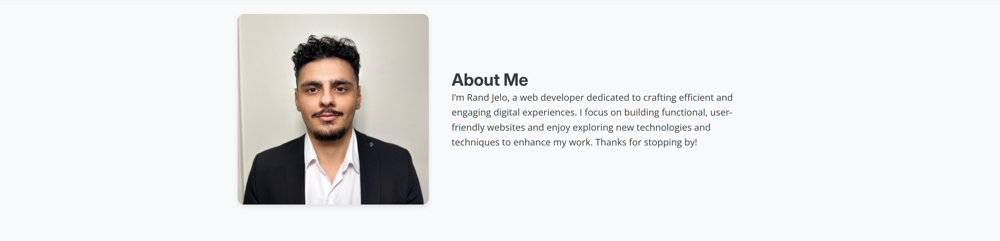
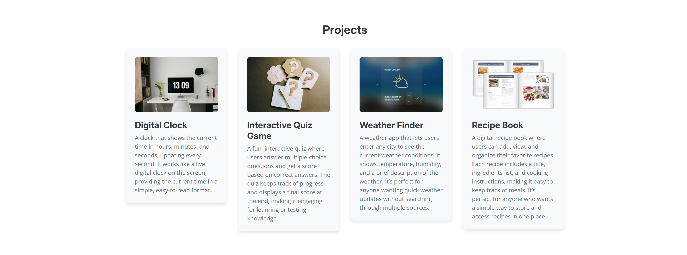
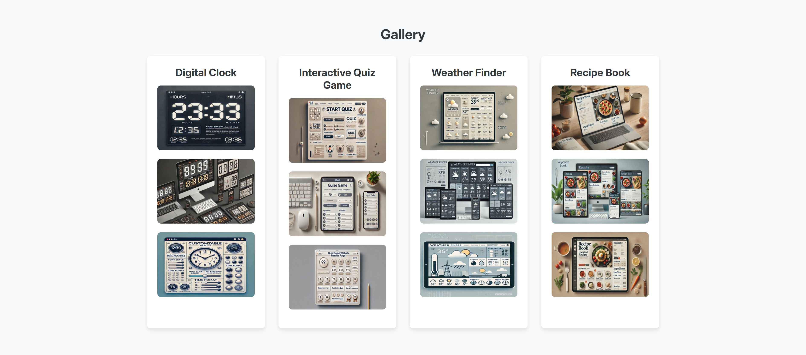
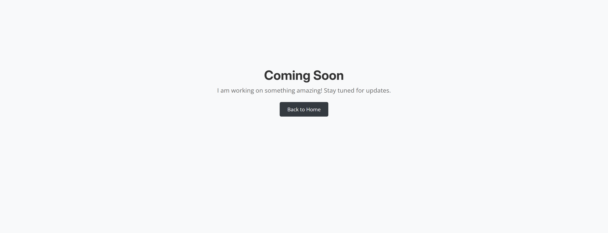
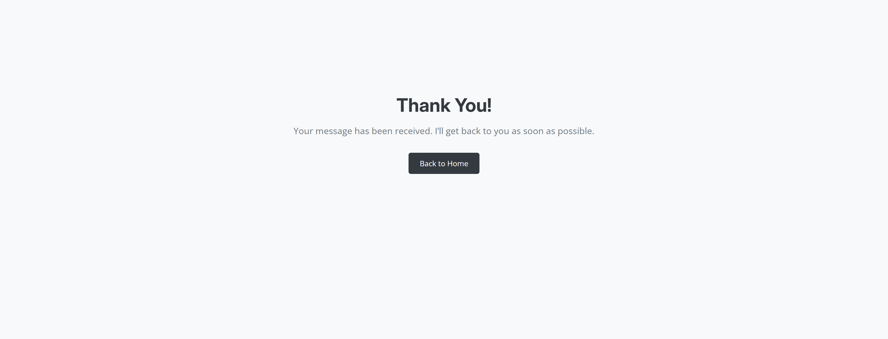

# Rand Jelo Portfolio

This portfolio showcases Rand Jelo's work as a web developer. It features a collection of projects, a gallery of images, and a contact form for reaching out. The portfolio is designed with responsive layouts for an optimal user experience on both mobile and desktop devices.

[View the project here](https://rand-jelo.github.io/Project-1/)

---

## User Experience (UX)

This portfolio aims to showcase Rand Jelo's web development skills, projects, and contact information for potential clients, collaborators, or employers.

### User Stories

 * **First-time visitors**
    * Easily understand the main purpose of the site and learn about Rand Jelo.
    * Navigate effortlessly to view the projects and gallery.
    * Quickly find and fill out the contact form.
 * **Returning visitors**
    * Revisit project information and see if new projects have been added.
    * Access Rand Jelo's contact information.
 * **Frequent users**
    * Check the gallery for new images.
    * Use the contact form to get in touch, especially if new questions or updates about projects arise.

---

## Design

 * **Color Scheme**: A minimalist color scheme, primarily dark gray (#343a40) with accent colors like #ffc107 for hover effects, ensures a professional look.
 * **Typography**: The portfolio uses "Inter" for headings and "Open Sans" for body text for readability and modern style.
 * **Wireframes**: Wireframes for this portfolio were created using Balsamiq.

    

---

## Features

* **Responsive Design**: The portfolio is fully responsive on all devices, with separate styling for mobile, tablet, and desktop screens.
* **Navigation Bar**: A sticky navigation bar is consistent across all pages, allowing easy access to different sections.
* **Project and Gallery Sections**: Projects and gallery images showcase Rand’s work and highlight key skills.
* **Contact Form**: Visitors can reach out via the contact form, which opens a "Thank You" confirmation page after submission.

### Existing Features

* **Header and Navigation**
    * Contains links to About Me, Projects, Gallery, and Contact sections.
    * Mobile-friendly navigation with a hamburger menu on smaller screens.

    

* **About Me Section**
    * A brief introduction to Rand Jelo's skills and experience as a web developer.

    

* **Projects Section**
    * Displays various projects with descriptions and images.
    * Provides an overview of Rand’s work and capabilities.

    

* **Gallery Section**
    * A collection of project-related images organized by project.

    

* **Contact Form**
    * Allows users to input their details and send a message.
    * Includes a “Thank You” confirmation page after submission.

    

* **Projects Page**
    * A placeholder page indicating future project additions.
    * Includes navigation, a main title, and a link back to the home page.

    

* **Thank You Page**
    * Displays a confirmation message after form submission.
    * Includes a link to return to the homepage for a smooth user experience.

    

* **Footer**
    * Links to social media for easy access.
    * Copyright and attribution information.

    

---

## Features Left to Implement

* Additional projects and gallery images as Rand’s portfolio grows.
* Blog or case study section detailing each project's development process.
* More interactive features in the gallery.

---

## Technologies Used

 * **HTML5**: For the structure of the website.
 * **CSS3**: For the styling of the website.

---

## Frameworks, Libraries & Programs Used

 * **Git**: Version control.
 * **GitHub**: Repository hosting and deployment.
 * **Google Fonts**: To import Inter and Open Sans fonts.
 * **Font Awesome**: For social media icons.
 * **Am I Responsive**: To preview the responsive design for this README.
 * **Balsamiq**: Used to create wireframes for layout planning.

---